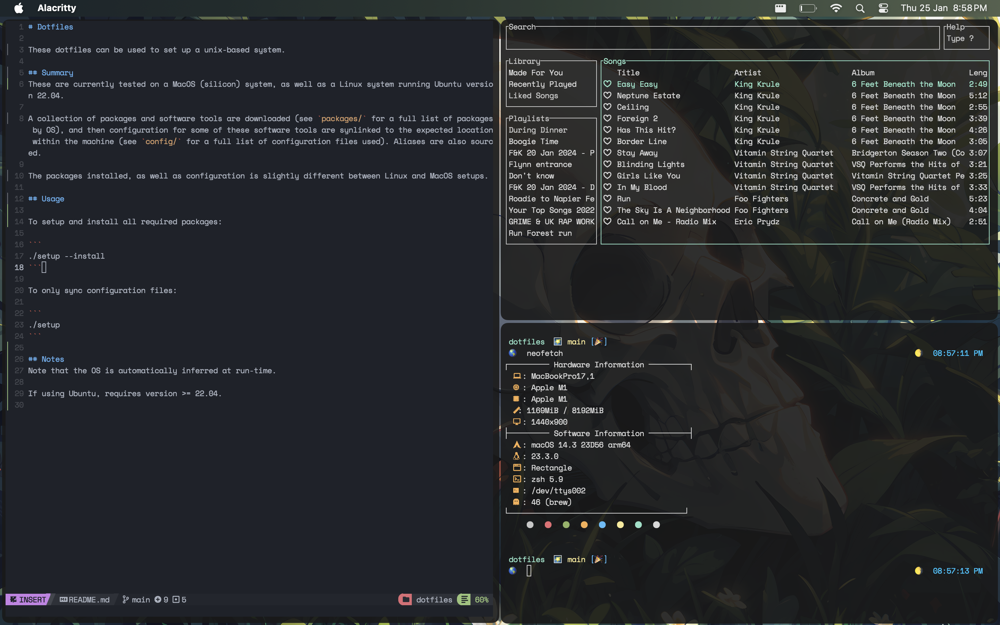

# Dotfiles

These dotfiles can be used to set up a unix-based system.

<p align="center">

</p>

These are currently tested on a MacOS (silicon) system, as well as a Linux system running Ubuntu version 22.04. 

A collection of packages and software tools are downloaded (see `packages/` for a full list of packages by OS), and then configuration for some of these software tools are synlinked to the expected location within the machine (see `config/` for a full list of configuration files used). Aliases are also sourced.

The packages installed, as well as configuration is slightly different between Linux and MacOS setups.

## Usage

To setup and install all required packages:

```
./setup --install
```

To only sync configuration files:

```
./setup 
```

## Notes
Note that the OS is automatically inferred at run-time.

If using Ubuntu, requires version >= 22.04.

